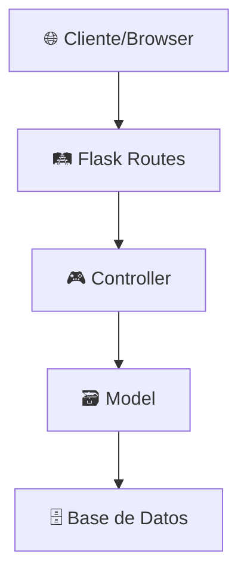
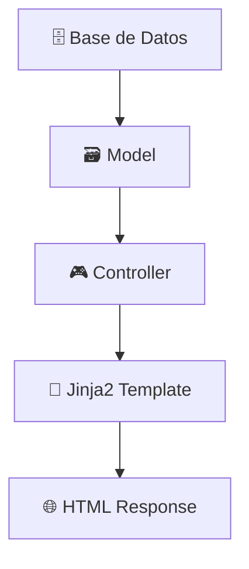

# 📚 Documentación de la Estructura del Proyecto SENA

## 🏗️ Arquitectura General

Este proyecto sigue el patrón **MVC (Model-View-Controller)** con **Flask** como framework backend y arquitectura de **blueprints** para la organización modular de las rutas.

```
PROYECTO-SENA/
├── 🗄️ backend/           # Lógica del servidor
├── 🎨 frontend/          # Interfaz de usuario
├── 📋 requirements.txt   # Dependencias Python
├── 📜 README.md         # Documentación principal
└── ⚖️ LICENSE          # Licencia del proyecto
```

---

## 🗄️ Backend - Arquitectura del Servidor

### 📁 Estructura del Backend

```
backend/
├── 🚀 main.py                    # Punto de entrada de la aplicación
├── ⚙️ config/                    # Configuración de la base de datos
│   ├── conexion.py               # Configuración de conexión MySQL
│   └── db.py                     # Inicialización de la base de datos
├── 🎮 controllers/               # Lógica de negocio (Controladores)
│   ├── __init__.py
│   ├── auth_controller.py        # Controller de autenticación
│   └── profile_controller.py     # Controller de perfil de usuario
├── 🗃️ models/                   # Modelos de datos (Acceso a BD)
│   └── user_model.py             # Modelo de usuario y roles
├── 🛤️ routes/                   # Definición de rutas (Router)
│   ├── auth/
│   │   └── auth.py               # Rutas de autenticación
│   ├── profile_routes.py         # Rutas del perfil de usuario
│   └── routes.py                 # Rutas principales
├── 🔧 services/                  # Servicios especializados
│   └── translator_service.py     # Servicio de traducción
└── 🛠️ utils/                    # Utilidades y helpers
    ├── utils.py                  # Utilidades generales
    └── video_utils.py            # Utilidades de video
```

### 🎯 Componentes Principales

#### 1. **🚀 main.py** - Aplicación Principal
```python
# Configuración de la aplicación Flask
def create_app():
    app = Flask(__name__, 
        static_folder="../frontend/static", 
        template_folder="../frontend/templates")
    
    # Configuración de sesiones
    app.secret_key = 'manuel'
    
    # Registro de blueprints
    app.register_blueprint(main_bp)      # Rutas principales
    app.register_blueprint(auth_bp)      # Rutas de autenticación  
    app.register_blueprint(profile_bp)   # Rutas de perfil
    
    return app
```

#### 2. **🎮 Controllers** - Lógica de Negocio

**AuthController** (`controllers/auth_controller.py`)
- ✅ `login_user()` - Autenticación de usuarios
- 🚪 `logout_user()` - Cierre de sesión
- 📝 `register_new_user()` - Registro de nuevos usuarios
- 🔐 `require_login()` - Validación de sesión activa
- 👤 `get_current_user()` - Obtener usuario actual

**ProfileController** (`controllers/profile_controller.py`)
- 👤 `get_user_profile()` - Obtener datos del perfil
- ✏️ `update_username()` - Actualizar nombre de usuario
- 📧 `update_email()` - Actualizar correo electrónico
- 🔒 `change_password()` - Cambiar contraseña
- 🗑️ `delete_account()` - Eliminar cuenta de usuario

#### 3. **🗃️ Models** - Acceso a Datos

**UserModel** (`models/user_model.py`)
- 🔍 `get_user_by_email()` - Buscar usuario por email
- 🆔 `get_user_by_id()` - Buscar usuario por ID
- ➕ `create_user()` - Crear nuevo usuario
- 📝 `update_user_username()` - Actualizar nombre
- 📧 `update_user_email()` - Actualizar email
- 🔐 `verify_current_password()` - Verificar contraseña
- 🔄 `change_user_password()` - Cambiar contraseña
- 🗑️ `delete_user_account()` - Eliminar cuenta
- 👥 `get_all_roles()` - Obtener roles disponibles

#### 4. **🛤️ Routes** - Definición de Endpoints

**Auth Routes** (`routes/auth/auth.py`)
```python
/auth/login     [GET, POST] - Inicio de sesión
/auth/logout    [GET]       - Cerrar sesión  
/auth/register  [GET, POST] - Registro de usuario
```

**Profile Routes** (`routes/profile_routes.py`)
```python
/profile/                    [GET]  - Página de perfil
/profile/update-username     [POST] - Actualizar usuario
/profile/update-email        [POST] - Actualizar email
/profile/change-password     [POST] - Cambiar contraseña
/profile/delete-account      [POST] - Eliminar cuenta
```

**Main Routes** (`routes/routes.py`)
```python
/           [GET] - Página de inicio
/dashboard  [GET] - Panel de usuario
```

---

## 🎨 Frontend - Interfaz de Usuario

### 📁 Estructura del Frontend

```
frontend/
├── 🎨 static/                    # Archivos estáticos
│   ├── 🎨 css/                   # Estilos CSS
│   │   ├── main/
│   │   │   └── main.css          # Estilos principales
│   │   ├── pages/               # Estilos por página
│   │   │   ├── index.css        # Página de inicio
│   │   │   ├── legal.css        # Páginas legales
│   │   │   ├── menu.css         # Menú de navegación
│   │   │   ├── profile.css      # Página de perfil
│   │   │   ├── senas.css        # Página de señas
│   │   │   └── texto.css        # Página de texto
│   │   └── utils/               # Estilos utilitarios
│   │       ├── auth.css         # Autenticación
│   │       ├── flash.css        # Mensajes flash
│   │       └── global.css       # Estilos globales
│   ├── 🖼️ img/                  # Imágenes e iconos
│   │   ├── actions/             # Iconos de acciones
│   │   ├── brand/               # Logo y marca
│   │   ├── content/             # Contenido visual
│   │   ├── features/            # Iconos de características
│   │   ├── social/              # Redes sociales
│   │   └── ui/                  # Elementos de interfaz
│   ├── 🎬 js/                   # JavaScript
│   │   ├── modos_traducion.js   # Lógica de traducción
│   │   ├── script.js            # Scripts principales
│   │   └── profile.js           # Funcionalidad del perfil
│   └── 🎥 video/               # Videos demostrativos
└── 📄 templates/               # Plantillas HTML (Jinja2)
    ├── 🔐 auth/                # Plantillas de autenticación
    │   ├── login.html          # Formulario de login
    │   ├── register.html       # Formulario de registro
    │   └── profile/
    │       └── index.html      # Página de perfil
    ├── 🏗️ base/               # Plantillas base
    │   ├── layout.html         # Layout principal
    │   └── components/         # Componentes reutilizables
    ├── ⚙️ features/           # Funcionalidades
    │   ├── tools/             # Herramientas
    │   └── translator/        # Traductor de señas
    │       ├── sign-to-text.html
    │       └── text-to-sign.html
    ├── ⚖️ legal/             # Páginas legales
    │   ├── privacy-policy.html
    │   └── terms-conditions.html
    └── 📑 pages/             # Páginas principales
        ├── home.html         # Página de inicio
        └── dashboard/        # Panel de usuario
```

---

## 🔄 Flujo de Datos

### 1. **📤 Request Flow** (Flujo de Petición)



### 2. **📥 Response Flow** (Flujo de Respuesta)



---

## 🛡️ Sistema de Autenticación

### 🔐 Proceso de Login

1. **📝 Usuario envía credenciales** → `/auth/login` (POST)
2. **🔍 Validación en AuthController** → `login_user()`
3. **🗃️ Verificación en UserModel** → `get_user_by_email()`
4. **🔐 Validación de contraseña** → `bcrypt.checkpw()`
5. **💾 Creación de sesión** → `session['user'] = user_data`
6. **↩️ Redirección** → Dashboard o página principal

### 👤 Gestión de Perfil

1. **🛡️ Verificación de sesión** → `require_login()`
2. **📄 Carga de datos** → `ProfileController.get_user_profile()`
3. **📝 Formularios de actualización** → Diferentes endpoints por acción
4. **✅ Validaciones** → En controller y modelo
5. **💾 Persistencia** → Base de datos MySQL
6. **💬 Feedback** → Mensajes flash al usuario

---

## 🗄️ Base de Datos

### 📊 Estructura de Tablas

**👥 usuarios**
```sql
id_usuario (INT, PK, AUTO_INCREMENT)
nombre (VARCHAR)
correo (VARCHAR, UNIQUE)
contrasena (VARCHAR, HASHED)
fecha_registro (TIMESTAMP)
id_rol (INT, FK)
```

**🎭 roles**
```sql
id_rol (INT, PK, AUTO_INCREMENT)
nombre_rol (VARCHAR)
descripcion (TEXT)
```

---

## 🚀 Tecnologías Utilizadas

### 🗄️ Backend
- **🐍 Python 3.x** - Lenguaje de programación
- **🌶️ Flask** - Framework web
- **🗄️ MySQL** - Base de datos
- **🔌 PyMySQL** - Conector de base de datos
- **🔐 bcrypt** - Hashing de contraseñas
- **📋 Jinja2** - Motor de plantillas

### 🎨 Frontend
- **🌐 HTML5** - Estructura
- **🎨 CSS3** - Estilos (Grid, Flexbox)
- **⚡ JavaScript** - Interactividad mínima
- **📱 Responsive Design** - Adaptable a dispositivos

---

## 📋 Mejores Prácticas Implementadas

### 🏗️ Arquitectura
- ✅ **Separación de responsabilidades** (MVC)
- ✅ **Modularidad** con Blueprints
- ✅ **Controladores dedicados** por funcionalidad
- ✅ **Reutilización de código**

### 🛡️ Seguridad
- ✅ **Hashing de contraseñas** con bcrypt
- ✅ **Validación de sesiones**
- ✅ **Sanitización de inputs**
- ✅ **Protección CSRF** (Flask integrado)

### 🎯 Mantenibilidad
- ✅ **Código organizado** por responsabilidades
- ✅ **Funciones pequeñas** y específicas
- ✅ **Documentación** clara
- ✅ **Patrones consistentes**

---

## 🔧 Configuración y Despliegue

### 📦 Instalación
```bash
# Clonar repositorio
git clone [repository-url]

# Instalar dependencias
pip install -r requirements.txt

# Configurar base de datos
# Editar backend/config/conexion.py

# Ejecutar aplicación
cd backend
python main.py
```

### 🌐 Acceso
- **🏠 Aplicación**: `http://localhost:5000`
- **🔐 Login**: `http://localhost:5000/auth/login`
- **📝 Registro**: `http://localhost:5000/auth/register`
- **👤 Perfil**: `http://localhost:5000/profile`

---

## 🔮 Funcionalidades Futuras

### 🎯 Próximas Implementaciones
- 🔄 **API REST** para aplicaciones móviles
- 🤖 **Integración con IA** para traducción de señas
- 📊 **Dashboard de analytics**
- 🌍 **Internacionalización** (i18n)
- 📧 **Sistema de notificaciones**
- 🎥 **Procesamiento de video en tiempo real**

---

*📅 Última actualización: Octubre 2025*
*👨‍💻 Desarrollado para el PROYECTO SENA*